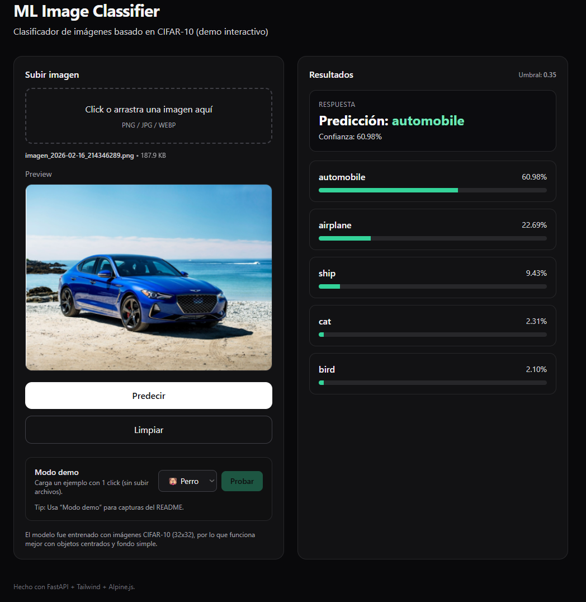
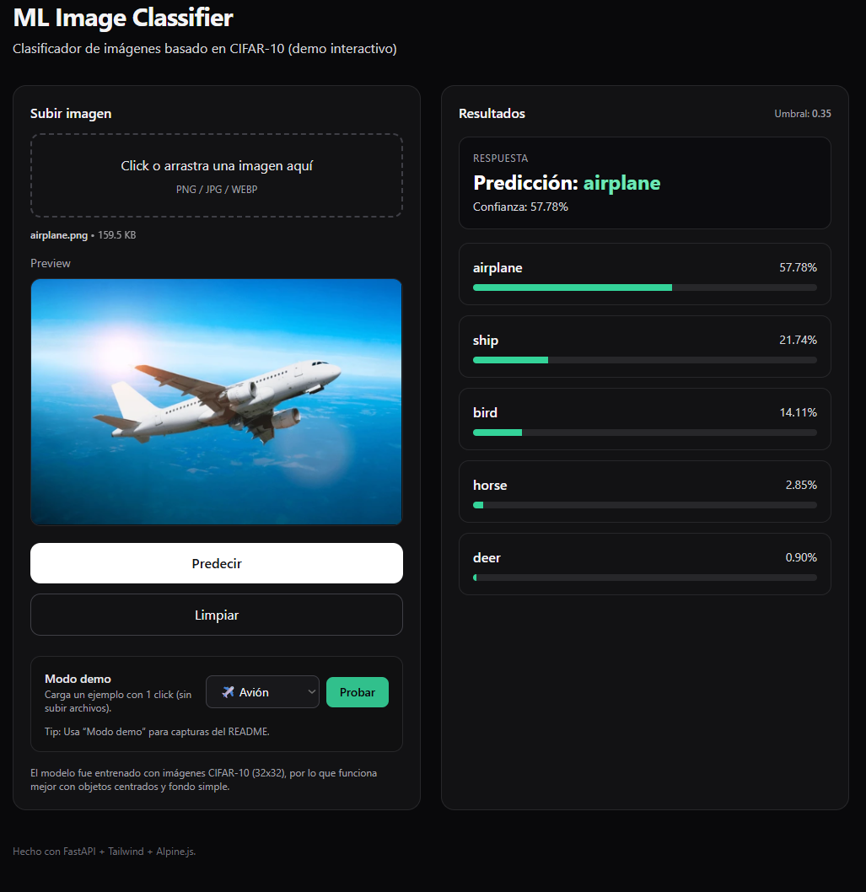

# 🧠 ML Image Classifier (CIFAR-10 Demo)

Clasificador de imágenes interactivo basado en **Machine Learning** que permite subir una imagen y obtener el **Top-5 de predicciones** utilizando un modelo entrenado con el dataset **CIFAR-10**.

El proyecto está diseñado como demostración práctica de un pipeline real de IA:  
preprocesamiento → inferencia → API → interfaz web.

## 📸 Demostracion

## 🎯 Objetivo del proyecto
Este proyecto muestra cómo integrar un modelo de visión computacional dentro de una aplicación web completa:

- Backend de inferencia en **FastAPI**
- Modelo de clasificación entrenado en **CIFAR-10**
- Interfaz web interactiva
- Visualización de probabilidades Top-5
- Sistema de ejemplos sin necesidad de subir archivos

No busca competir con modelos modernos, sino demostrar la arquitectura real de despliegue de un modelo ML.

## 🧠 Sobre el modelo
El modelo fue entrenado con **CIFAR-10 (32x32 px)**, por lo que funciona mejor cuando:

- El objeto está centrado
- Fondo simple
- Poca profundidad de escena
- Imagen similar a dataset académico

Fotos reales o complejas pueden generar ambigüedad en la predicción.

> ⚠️ Esto es esperado y forma parte del comportamiento normal de modelos entrenados con datasets pequeños.

## 🚀 Escalabilidad
La arquitectura implementada es completamente escalable:

- El backend puede reemplazar el modelo por **ResNet / EfficientNet / YOLO / ViT**
- Permite conectar almacenamiento en nube
- Soporta procesamiento batch
- Puede integrarse con pipelines MLOps

Es decir, aunque el demo usa CIFAR-10 por simplicidad académica, la tecnología está preparada para modelos de mayor complejidad.

## 🧩 Tecnologías utilizadas

**Backend**
- FastAPI
- Python
- Numpy / Pillow

**Machine Learning**
- Modelo CNN entrenado en CIFAR-10

**Frontend**
- HTML + TailwindCSS
- Alpine.js

## 🖥️ Ejecución local

git clone https://github.com/tuusuario/ml-image-classifier.git

cd ml-image-classifier

pip install -r requirements.txt

uvicorn app.main:app --reload

Abrir en navegador:

http://127.0.0.1:8000

## Clases del modelo actual:

El modelo reconoce las siguientes categorías:

- airplane
- automobile
- bird
- cat
- deer
- dog
- frog
- horse
- ship
- truck